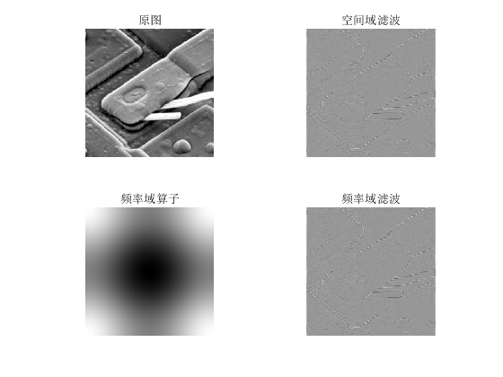

# 数字图像处理第二次实验报告
181860066 牛铭杨
## assignment 1
### 一、实验思路和实现细节
本实验要求比较无零填充和有零填充滤波过后图像的不同。我使用`matlab`实现本次实验，分别生成无零填充和有零填充的图像，实现步骤主要有以下几步：

1.无零填充

- 使用`im2double`将原图转换成浮点数矩阵`f`
- 将`f(x, y)`乘以$(-1)^{(x+y)}$，将图像移到频率域中心
- 使用`fft2`函数对`f`做傅里叶变换得到`F`
- 按照定义计算出高斯低通滤波器`H`，对`F`滤波
- 使用`ifft2`回到空间域，取函数实部，并乘以$(-1)^{(x+y)}$得到滤波后的图像

2.有零填充

- 使用`im2double`将原图转换成浮点数矩阵`f`
- 将`f(x, y)`乘以$(-1)^{(x+y)}$，将图像移到频率域中心
- 对`f`进行零填充，长宽都变为原来的两倍，并使用`fft2`函数对`f`做傅里叶变换得到`F`
- 按照定义计算出高斯低通滤波器`H`，对`F`滤波
- 使用`ifft2`回到空间域，裁减图像只取左上角，变为原来的大小，取函数实部，并乘以$(-1)^{(x+y)}$得到滤波后的图像

### 二、实验结果

明显可以看出，图(b)的边缘只有上面有黑边，左右没有，而图(c)明显三个方向都有

### 三、遇到的问题及解决方法
1.关于`fspecial`函数的作用。我原来以为`fspecial`函数会直接生成频率域滤波器，但读了文档、经过试验之后发现这个函数的输出是空间域滤波器，如果想得到频率域滤波器还要进行转换。所以我直接没用这个函数，自己在频率域根据定义计算出了高斯低通滤波器。

2.关于`fft2`函数的作用。读了文档发现这个函数可以直接指定图像频率域的大小，不够大会自动进行零填充，所以不需要再自己手动进行零填充了。

## assignment 2
### 一、实验思路和实现细节
本实验要求实现教材图4.36中的滤波过程，生成从b到h的图像。我使用`matlab`实现本次实验，assignment2和assignment1的主要操作基本上相差不多，只不过由于要生成零填充的图像，所以无法使用`fft2`函数的自动零填充。实现步骤主要有以下几步：

- 输出图像(a),并使用`im2double`将原图转换成浮点数矩阵`f`
- 对`f`做零填充，输出图像(b)
- 将`f(x, y)`乘以$(-1)^{(x+y)}$，将图像移到频率域中心，输出图像(c)
- 使用`fft2`函数对`f`做傅里叶变换得到`F`，使用`abs(F)`计算`F`的幅值并归一化到 $[0, 256]$ ，做对数灰度变换后输出图像(d)
- 计算高斯低通滤波器并输出图像(e)
- 滤波之后输出图像(f)
- 转换回空间域，并乘以$(-1)^{(x+y)}$，得到图像(g)
- 裁减图像获得图像(h)

### 二、实验结果

### 三、遇到的问题及解决方法
1.输出`F`的傅里叶谱时，总是只能看到图像正中的一个亮点，跟书上的图像不一样，然后我发现需要做一次对数灰度变换，就和书上的图一样了

## assignment 3
### 一、实验思路和实现细节
本实验要求仿照教材中图4.39，验证空间域滤波和频率域滤波的等价性。对于给定的空间域滤波器（如sobel算子），生成空间域滤波器对应的频域滤波器，然后基于得到的频域滤波器在频域对图像进行对应的滤波操作，并且与在空间域直接滤波得到的结果进行对比。我使用`matlab`实现本次实验，使用了两张测试图片，实现了四个空间滤波器(sobel算子、laplacian算子、laplacian算子的对角线形式、均值滤波器)的空间滤波和频域滤波比较。代码总共有2个文件，assignment.m和image_filtering.m。其中assignment.m是主程序，负责读入图像并指定使用的算子，image_filtering.m负责对给定的算子分别对图像进行空间域和频率域滤波，并输出图像。实现步骤主要有以下几步：

1.空间域滤波（相关操作）
- 找到零填充后的大小`p`,`q`，它们分别等于原图和滤波器大小相加减一
- 对原图进行0填充，使原图处在0的中间，以便空间域滤波
- 通过相关操作进行空间域滤波，生成滤波后的图像

2.由空间滤波器生成频率域滤波器
- 找到零填充后的大小`p`,`q`
- 对空间域滤波算子`h`进行零填充，将算子放在填充后的图像的中心
- 将`h(x, y)`乘以$(-1)^{(x+y)}$，将算子移到频率域中心
- 对`h`做傅里叶变换，并乘以$(-1)^{(x+y)}$，将`h`移到`hp`的中心，得到频率域滤波算子`H`

3.频率域滤波
- 使用生成好的滤波算子`H`进行频率域滤波得到频率域滤波后的图像，细节和assignment2类似

### 二、实验结果
- sobel算子

- laplacian算子

- laplacian算子对角线形式

- 均值滤波

观察可以发现频率域和空间域滤波的结果基本相同。

### 三、遇到的问题及解决方法
1.生成的滤波后的图像和书上的灰色图像不一样，但与直接调用库函数`imfilter`的结果相同。后来发现生成的图像并没有错误，只不过`imshow`函数中要加上第二个参数`[]`，这样就会自动对图像显示的灰度进行调整，结果就和书上的图一致了。

2.生成除sobel算子外的其他算子错误。我是按照书中描述的步骤来操作的。书上有一步将转换到频率域的算子的实部置为0，理由是它一定是纯虚函数。但我参考了后面的频率域拉普拉斯算子发现并不是所有空间域算子转换到频率域都是纯虚函数，书上的描述仅仅针对sobel算子而言。去掉这步之后成功输出图像。

3.sobel算子频率域滤波和空间域滤波的结果稍有不同。把图片放大仔细观察，可以发现sobel空间域滤波和频率域滤波的结果有的地方正好相反，差别十分微小，要仔细观察才能发现，我重新看了书上的公式，发现转换到频率域的方法里面，频率域滤波是和空间域做卷积操作等价，而我是做的相关操作，我将算子翻转之后果然得到了相同的结果。而其他算子不会发生这种情况，因为其他算子都是中心对称的。

## assignment 4
### 一、实验思路和实现细节
本次实验要求实现一个属于自己的美颜软件，使用学到的滤波等方法，对图片进行美颜。我实现了灰色图像和彩色图像的美颜，使用的方法是高斯双边滤波，主要的效果是消除皱纹和痘痘，对人脸进行磨皮美白。因为消除皱纹主要是使用低通滤波器滤除高频分量，但是这样整张图片都会变得很模糊，于是需要使用保留边缘的滤波算法，查阅资料，我得知高斯双边滤波可以实现这种效果。我使用`matlab`实现本次实验，共有两个代码文件，assignment4.m和impove.m。assignment4.m负责读入图片和组织输出格式，impove.m负责对图像进行美颜。使用了四张测试图片，一场灰度图片三张彩色图片。主要实验步骤如下：

- 对彩色图像和灰色图像分开处理。彩色图像对RGB三个通道分别操作，灰色图像直接对灰度操作
- 指定高斯双边滤波器的参数。我这次实验使用的参数如下：11*11的高斯双边滤波器进行空间滤波，其中距离的截止频率${\delta}_d = 3$，灰度值的截止频率${\delta}_r = 0.1$
- 利用高斯滤波器的滤波公式
$$g(x, y) = \frac{\sum\limits_{i, j \in S_{x,y}} w(x, y, i, j) f(i, j)}{\sum\limits_{i, j \in S_{x,y}} w(x, y, i, j)}$$
进行空间滤波，得到滤波后的图像。
其中$S_{x,y}$是$(x,y)$的邻域，$w(x, y, i, j)$是$(x,y)$处的权重矩阵，给定$(x, y)$，
$$w(i, j) = w_d(i, j) w_r(i, j)$$
$$w_d(i, j) = e^{-\frac{(i-x)^2+(j-y)^2}{2 \delta_d^2}}$$
$$w_r(i, j) = e^{-\frac{(f(i, j)-f(x, y))^2}{2 \delta_r^2}}$$

### 二、实验结果

可以看出磨皮美白效果很明显，人脸上的痘痘和皱纹完全不见了，有一种油画的感觉。

### 三、遇到的问题及解决方法
1.消除皱纹主要是使用低通滤波器滤除高频分量，但是如果简单地用低通滤波器平滑图像，整张图片都会变得很模糊，美颜效果哦很差，于是需要使用保留边缘的滤波算法，查阅资料，我得知高斯双边滤波可以实现这种效果，实现效果良好，边缘得到了很好的保留，痘痘，皱纹等也被消除。