# 数字图像处理第三次实验报告
181860066 牛铭杨
***********************************
## 第一部分 edge detection
### 一、实验思路和实现细节
本实验要求完成`my_edge.m`函数，实现对给定图像的边缘检测问题，我总共实现了五个边缘检测算子，基本边缘检测有`roberts`算子，`prewitt`算子，`sobel`算子，高级边缘检测有`Marr-Hildreth`边缘检测器和`Canny`边缘检测器，通过`my_edge.m`中的一个变量`method`来选择。对于图片noise.jpg，观察可以发现存在椒盐噪声，先用中值滤波器滤波即可。实验步骤主要如下：
- 基本边缘检测
`roberts`算子，`prewitt`算子，`sobel`算子使用的方法大体类似，可以归为一类说明。
首先找到两个方向的滤波算子，对于`roberts`算子:
$$
r_x = 
\begin{pmatrix} -1&0\\0&1 \end{pmatrix}, \quad r_y = \begin{pmatrix} 0&-1\\1&0 \end{pmatrix}
$$
注意这里实际上是对角算子，处于命名方便如此命名。
`prewitt`算子:
$$
p_x = \begin{pmatrix} -1&0&1\\-1&0&1\\-1&0&1 \end{pmatrix}, \quad p_y = \begin{pmatrix} -1&-1&-1\\0&0&0\\1&1&1 \end{pmatrix}
$$
`sobel`算子:
$$
s_x = \begin{pmatrix} -1&0&1\\-2&0&2\\-1&0&1 \end{pmatrix}, \quad s_y = \begin{pmatrix} -1&-2&-1\\0&0&0\\1&2&1 \end{pmatrix}
$$
使用均值滤波器滤波对图像进行平滑处理，防止噪声影响导数；然后分别用两个方向的滤波算子进行空间滤波，得到图像`gx`和`gy`，然后计算`|gx|+|gy|`得到灰度图，利用一个阈值将灰度图转化为二值图像即可。

- `Marr-Hildreth`边缘检测器
首先根据参数`sigma`确定滤波器的大小，大于六倍`sigma`的最小整数。
其次利用公式
$$
\begin{aligned}
\nabla^2 G(x, y) &= \frac{\partial^2 G(x, y)}{\partial x^2} + \frac{\partial^2 G(x, y)}{\partial y^2}\\
&= \frac{x^2+y^2-2\sigma^2}{\sigma^4} e^{-\frac{x^2+y^2}{2\sigma^2}}
\end{aligned}
$$
采样计算`LoG`算子，并对图像进行空间滤波。然后找图像的零交叉点。如果某个像素点邻域中相对的像素点符号相反，且差的绝对值超过某个设定好的阈值，则该点为零交叉点，将其置为1，否则置为0。这样就得到了二值图像。

- `Canny`边缘检测器
首先利用高斯函数对图像进行滤波平滑图像，然后计算每个像素点的梯度大小`M`和角度`theta`，之后根据梯度方向进行非最大抑制，只有像素点比它梯度方向上两个邻点都大时才保留，否则将灰度置为零。最后进行滞后阈值处理，选择好低阈值`lowTH`和高阈值`highTH`，高于高阈值的像素点保留，低于低阈值的像素点舍弃，两者之间的像素点若8-邻域中有高于高阈值的像素点也保留。最后得到二值图像。

### 二、实验结果
- ayu.jpg
原图为：

不同边缘检测器的结果：
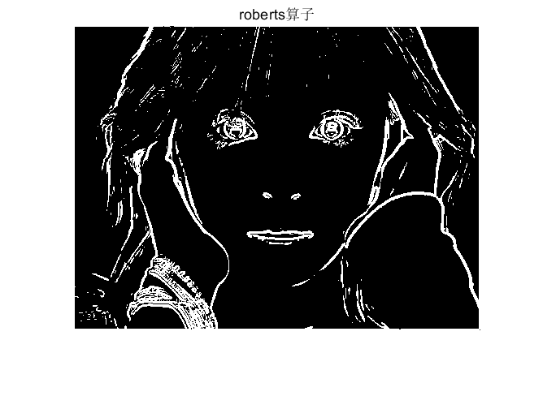

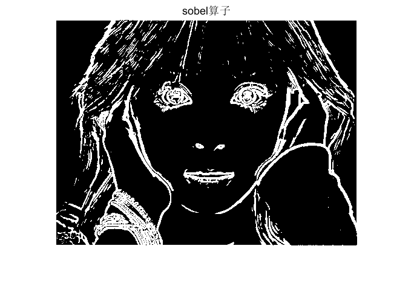
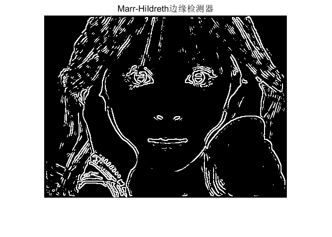
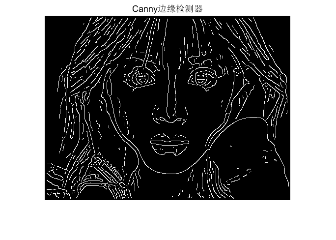
使用的参数为
```matlab
% parameters for 'roberts' 'prewitt' 'sobel'
aversize = 3;        % 均值滤波器大小
bound = 0.07;        % 灰度图像转化为二值图像的阈值(占最大值的比例)

% parameters for 'MarrHildreth'
sigma = 2;           % 高斯滤波器的参数
rate = 0.15;         % 找零交叉点时的阈值(占最大值的比例)

% parameters for 'Canny'
sigma2 = 2;          % 高斯滤波器的参数
lowTH = 0.03;        % 滞后阈值的低阈值
highTH = 2 * lowTH;  % 滞后阈值的高阈值
```

- giraffe.jpg
原图为：

不同边缘检测器的结果：


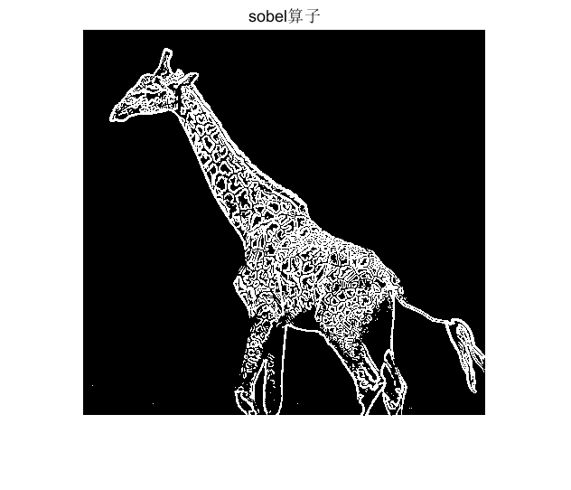
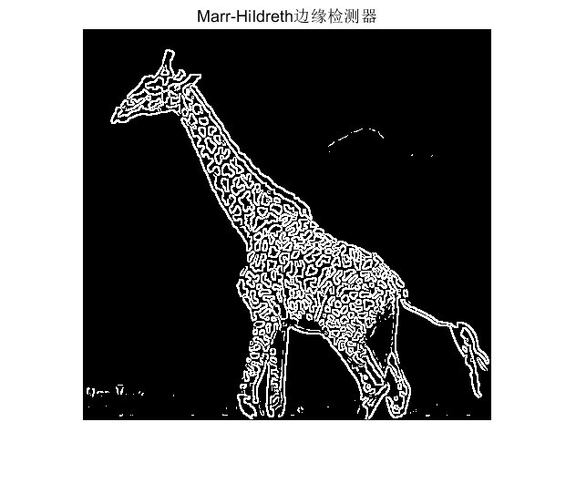
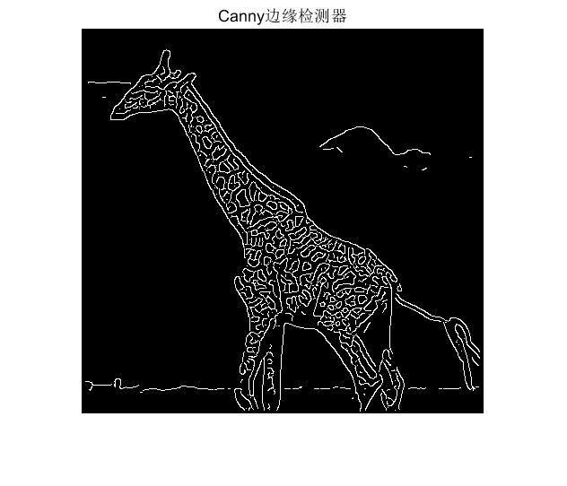
使用的参数为
```matlab
% parameters for 'roberts' 'prewitt' 'sobel'
aversize = 2;        % 均值滤波器大小
bound = 0.15;        % 灰度图像转化为二值图像的阈值(占最大值的比例)

% parameters for 'MarrHildreth'
sigma = 2;           % 高斯滤波器的参数
rate = 0.15;         % 找零交叉点时的阈值(占最大值的比例)

% parameters for 'Canny'
sigma2 = 2;          % 高斯滤波器的参数
lowTH = 0.05;        % 滞后阈值的低阈值
highTH = 2 * lowTH;  % 滞后阈值的高阈值
```

- leaf.jpg
原图为：

不同边缘检测器的结果：
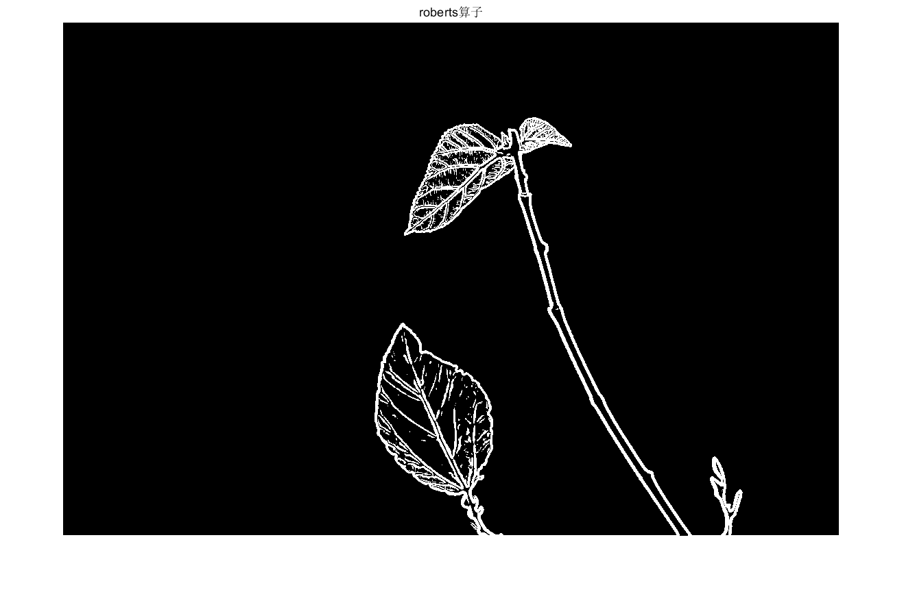
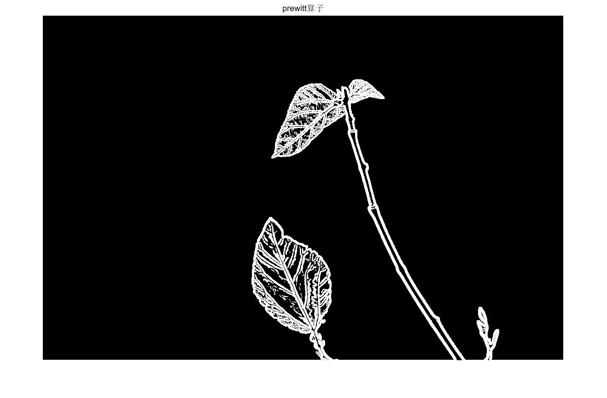
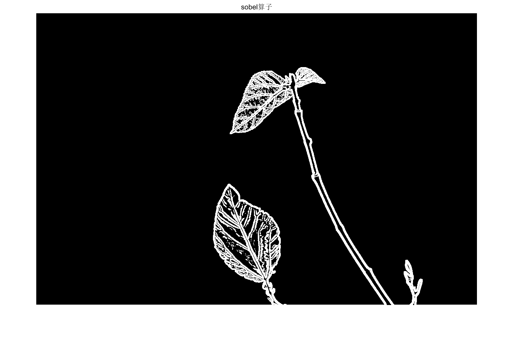
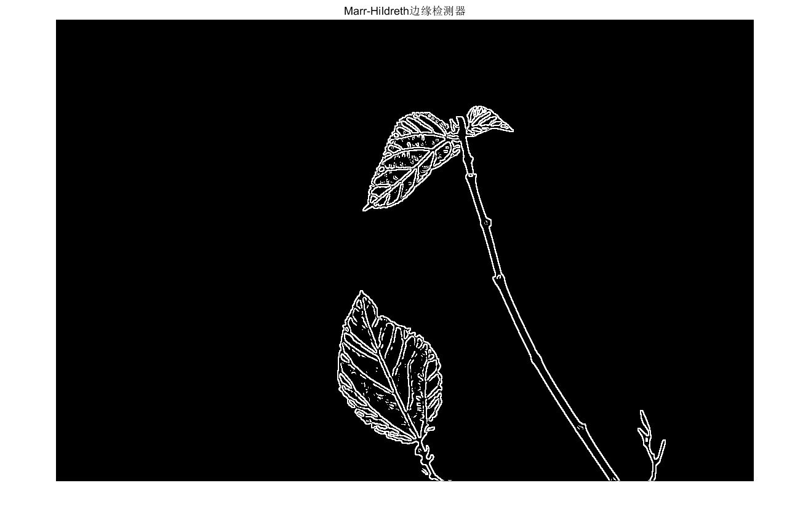
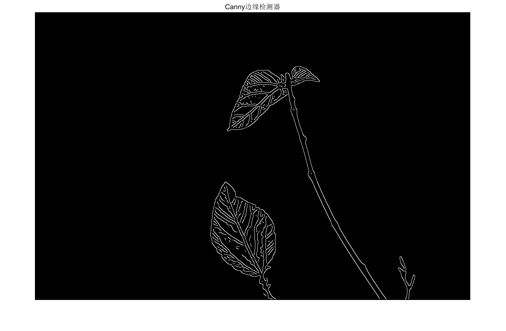
使用的参数为
```matlab
% parameters for 'roberts' 'prewitt' 'sobel'
aversize = 3;        % 均值滤波器大小
bound = 0.06;        % 灰度图像转化为二值图像的阈值(占最大值的比例)

% parameters for 'MarrHildreth'
sigma = 2;           % 高斯滤波器的参数
rate = 0.15;         % 找零交叉点时的阈值(占最大值的比例)

% parameters for 'Canny'
sigma2 = 2;          % 高斯滤波器的参数
lowTH = 0.05;        % 滞后阈值的低阈值
highTH = 2 * lowTH;  % 滞后阈值的高阈值
```

- rubberband_cap.png
原图为：
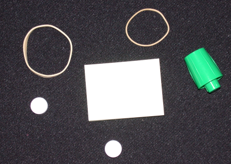
不同边缘检测器的结果：
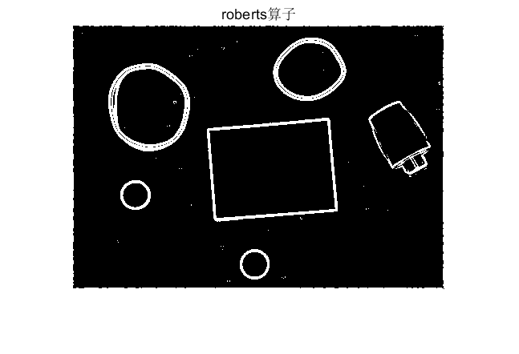
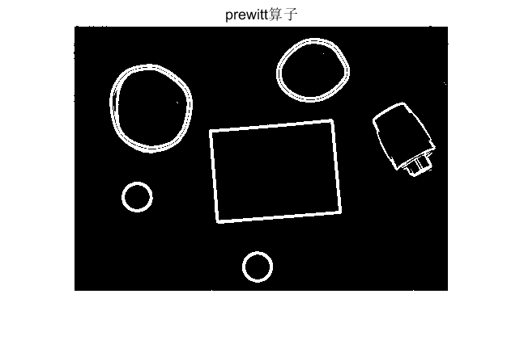

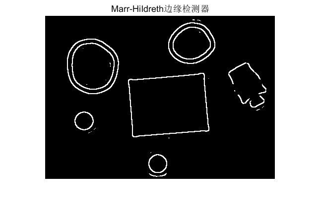
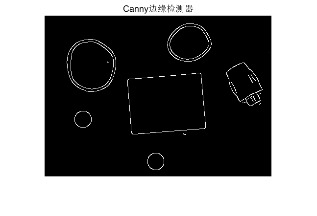
使用的参数为
```matlab
% parameters for 'roberts' 'prewitt' 'sobel'
aversize = 3;        % 均值滤波器大小
bound = 0.2;         % 灰度图像转化为二值图像的阈值(占最大值的比例)

% parameters for 'MarrHildreth'
sigma = 4;           % 高斯滤波器的参数
rate = 0.3;          % 找零交叉点时的阈值(占最大值的比例)

% parameters for 'Canny'
sigma2 = 2;          % 高斯滤波器的参数
lowTH = 0.05;        % 滞后阈值的低阈值
highTH = 2 * lowTH;  % 滞后阈值的高阈值
```

- noise.jpg
观察可以发现这幅图像中存在明显的椒盐噪声，且颗粒较大，概率较小，因此我采用了$9 \times 9$的中值滤波器对图像进行处理。
原图为：

中值滤波后的灰度图像为：

可以看出椒盐噪声得到了明显的改善。
不同边缘检测器的结果：
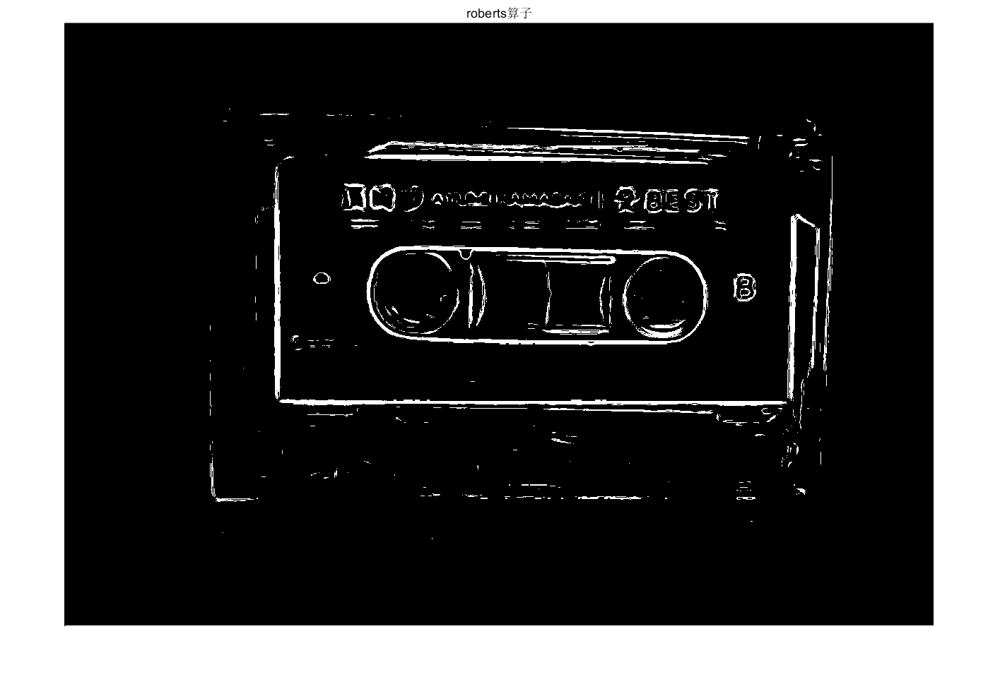
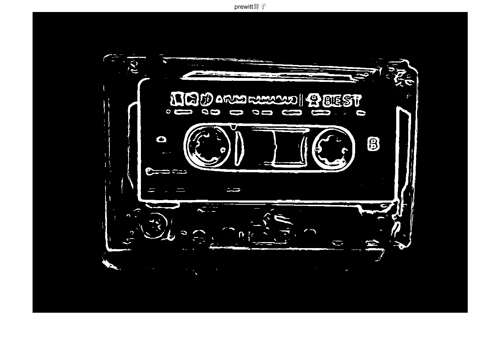
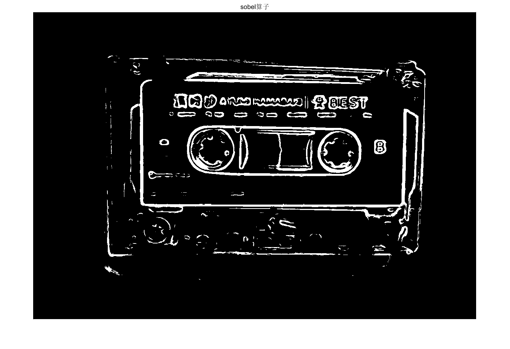
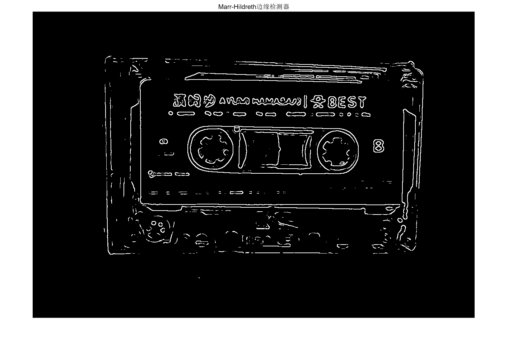
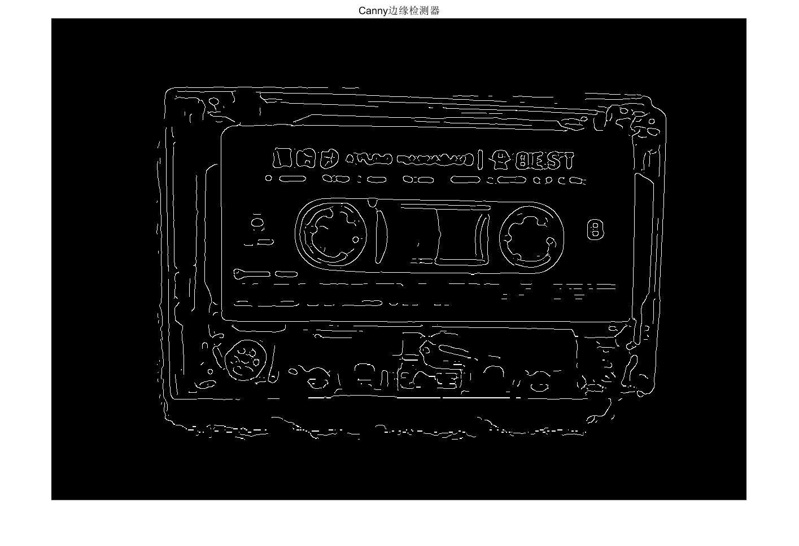
使用的参数为
```matlab
% parameters for 'roberts' 'prewitt' 'sobel'
aversize = 1;        % 均值滤波器大小
bound = 0.06;        % 灰度图像转化为二值图像的阈值(占最大值的比例)

% parameters for 'MarrHildreth'
sigma = 2;           % 高斯滤波器的参数
rate = 0.1;          % 找零交叉点时的阈值(占最大值的比例)

% parameters for 'Canny'
sigma2 = 2;          % 高斯滤波器的参数
lowTH = 0.03;        % 滞后阈值的低阈值
highTH = 2 * lowTH;  % 滞后阈值的高阈值
```

### 三、遇到的问题及解决方法
1.一开始使用Canny边缘检测器总是出现星形的奇怪区域，检查算法后发现是由于菲最大抑制时每个方向比较的不同邻居弄混了。
2.Marr-Hildreth边缘检测器找零交叉点时，书上和Slides上的讲解过于简单，有的细节并未涉及，我查阅相关资料才找到具体的做法。

***********************************
## 第二部分 edge linking
### 一、实验思路和实现细节
本实验要求完成`my_edgelinking.m`函数，并使用任意边缘链接方法来获得尽可能完整和准确的边界。主要算法如下：
我了解了`my_edgelinking`函数的输入和输出之后，使用了8-邻域边缘跟踪方法，对于输入的某一个像素点，从它的$3 \times 3$邻域的上方开始，逆时针访问与它相邻的8个像素点，只要访问到一个值为1，那么该邻居就是下一个边界点。这里我有一个`neighbour`矩阵，分别代表搜索的8个方向，可以与当前像素点进行矩阵加法，简洁地表示正在被搜索的像素点。
```matlab
    neighbour = [-1, 0; -1, -1; 0, -1; 1, -1; 1, 0; 1, 1; 0, 1; -1, 1];
    % 表示方向为   上     左上   左     左下    下    右下  右     右上
    % 对应dir为    0      1      2      3      4      5    6       7
```
然后继续搜索，直到这个边界所有的边界点已经被找到(即某个像素点的8个邻居都不符合要求)。同时设置一个`used`矩阵，记录某个点是否已经被访问过，访问过的像素点不再被访问，即使它满足上面的条件。实践中发现对于闭合曲线经常无法走完全部轮廓，会在轮廓走向转折的地方就退出循环，于是我查阅资料，添加了一个条件：每找到一个新的边界点，记录从上个边界点走到这个边界点的方向，这时不是再从上方开始搜索，而是从上个方向顺时针旋转$90^{\circ}$开始搜索，这样可以避免在转弯的地方走入“死胡同”。

### 二、实验结果
原图为

Canny边缘检测器的结果：

使用的参数为
```matlab
% parameters for 'Canny'
sigma2 = 2;          % 高斯滤波器的参数
lowTH = 0.05;        % 滞后阈值的低阈值
highTH = 2 * lowTH;  % 滞后阈值的高阈值
```
在`imtool`中观察图像，并手动选择选择以下点进行边界跟踪
```matlab
point = [151,445; 118,311; 146,128; 141,125; 90, 292;
         94, 292; 316,227; 229, 80; 161,433; 177,427;
         174,431; 159,392; 138,426; 134,431];
```
轮廓线段长度为1，设为白色，得到边界图为
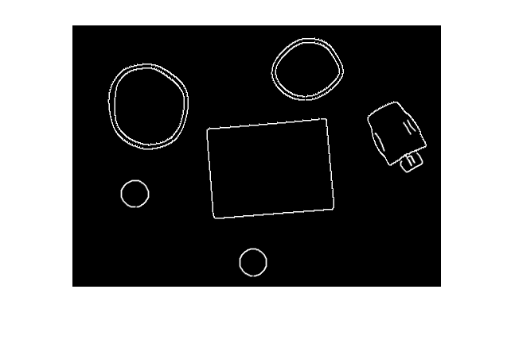
细节图为
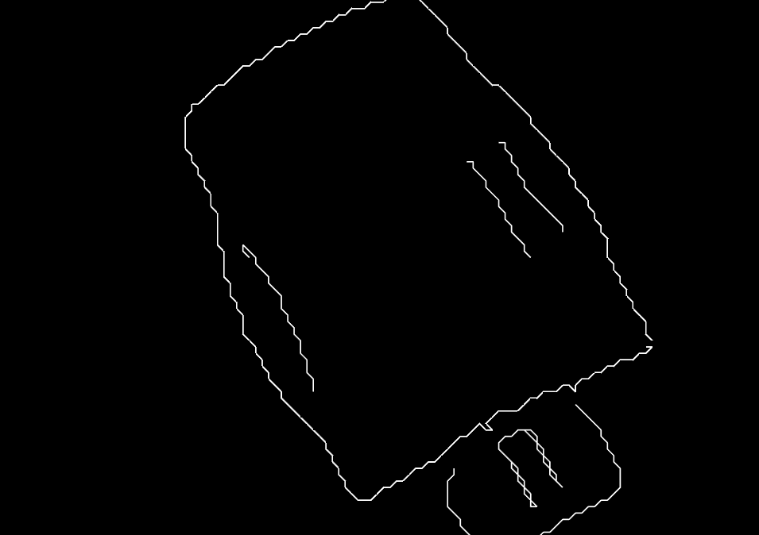
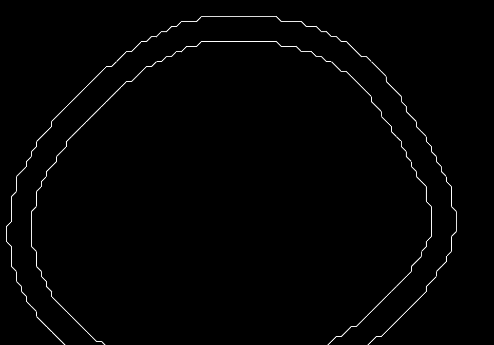

### 三、遇到的问题及解决方法
1.使用`imtool`函数观察图像的像素点信息时，标定的`x`和`y`坐标和图像矩阵的坐标正好相反，我一开始没意识到这个问题，总是提示矩阵索引越界。
2.8-邻域边缘跟踪算法，实践中发现对于闭合曲线经常无法走完全部轮廓，会在轮廓走向转折的地方就退出循环，于是我查阅资料，添加了一个条件：每找到一个新的边界点，记录从上个边界点走到这个边界点的方向，这时不是再从上方开始搜索，而是从上个方向顺时针旋转$90^{\circ}$开始搜索，这样可以避免在转弯的地方走入“死胡同”。